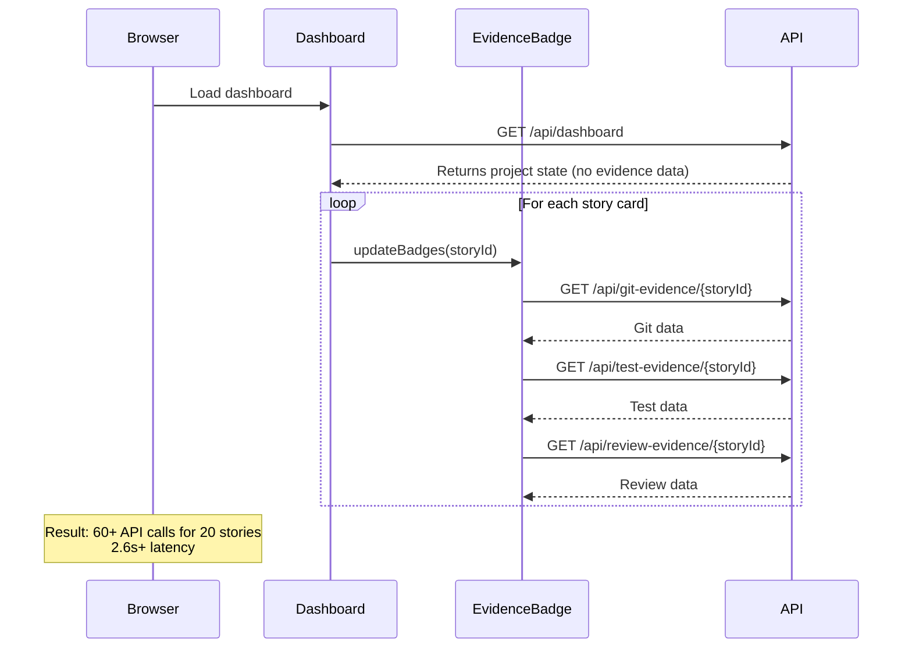
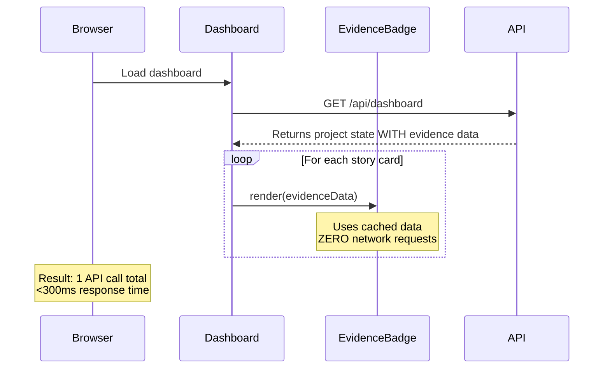

# Story 5.5: Critical Fix - AI Context Injection & Dashboard Caching

## Overview

This story addresses two critical issues that prevent the BMAD Dash from functioning as intended:

1. **Dashboard N+1 Performance Problem**: Each story card triggers individual API calls instead of using cached data
2. **AI Context Injection Failure**: The AI Coach lacks project state context and cannot answer basic questions

**Priority:** Critical
**Estimated Complexity:** Medium
**Dependencies:** Story 5.4 (Evidence-based Task Progress Inference)

---

## Problem Analysis

### Issue 1: Dashboard N+1 Performance

**Current Flow (Broken):**



**Root Cause:**
1. [`backend/api/dashboard.py`](backend/api/dashboard.py:451-469): `build_kanban()` does NOT include `story.evidence` data
2. [`frontend/js/views/dashboard.js`](frontend/js/views/dashboard.js:45-51): Calls `updateBadges()` for each story
3. [`frontend/js/components/evidence-badge.js`](frontend/js/components/evidence-badge.js:27-49): `updateBadges()` makes 3 API calls per story

**Fixed Flow:**



### Issue 2: AI Context Injection

**Current Behavior:**
- AI asks "Please provide context" when asked about project state
- The `_build_system_prompt()` in [`ai_coach.py`](backend/services/ai_coach.py:134-269) loads project state but:
  - Full JSON may be too large (truncation risk)
  - `project_root` is NOT passed from frontend context
  - No logging to diagnose issues

**Root Cause:**
1. [`frontend/js/app.js`](frontend/js/app.js:74-100): Context passed to `setProjectContext()` lacks `project_root`
2. [`backend/services/ai_coach.py`](backend/services/ai_coach.py:144-158): Full JSON dump of project state is too verbose
3. No logging to verify context is being loaded correctly

---

## Implementation Plan

### Phase 1: Fix Dashboard N+1 Performance

#### 1.1 Backend: Include Evidence in Dashboard Response

**File:** [`backend/api/dashboard.py`](backend/api/dashboard.py)

**Change:** Modify `build_kanban()` to include evidence data

```python
# Line 451-469: Add evidence to story_data
story_data = {
    "story_id": story.story_id,
    "id": story.story_id,
    "title": story.title,
    "epic": story.epic,
    "status": story.status,
    "last_updated": story.last_updated if hasattr(story, 'last_updated') else None,
    "tasks": [task.to_dict() for task in story.tasks],
    # ADD: Include evidence data
    "evidence": story.evidence if hasattr(story, 'evidence') else {}
}
```

#### 1.2 Frontend: Accept Evidence Data Instead of Fetching

**File:** [`frontend/js/components/evidence-badge.js`](frontend/js/components/evidence-badge.js)

**Change:** Add `renderBadgesFromData()` function that accepts pre-fetched data

```javascript
// NEW: Render badges from pre-fetched data (no network calls)
export function renderBadgesFromData(containerId, evidenceData, storyId, projectRoot) {
    const container = document.getElementById(containerId);
    if (!container) return;

    // Parse evidence data
    const gitData = evidenceData.commits !== undefined ? {
        status: evidenceData.commits > 0 ? 'green' : 'red',
        commits: [{ message: 'cached' }], // Minimal data for display
        count: evidenceData.commits
    } : null;

    const testData = evidenceData.tests_passed !== undefined ? {
        status: (evidenceData.tests_total > 0 && evidenceData.healthy) ? 'green' : 'yellow',
        pass_count: evidenceData.tests_passed || 0,
        total_tests: evidenceData.tests_total || 0
    } : null;

    renderBadges(container, gitData, testData, null, storyId, projectRoot);
}
```

#### 1.3 Frontend: Pass Evidence Data to Badges

**File:** [`frontend/js/views/dashboard.js`](frontend/js/views/dashboard.js)

**Change:** Replace `updateBadges()` calls with `renderBadgesFromData()`

```javascript
// Line 45-51: Replace updateBadges with renderBadgesFromData
allStories.forEach(story => {
    const boardBadgeId = `board-badges-${story.id}`;
    if (document.getElementById(boardBadgeId)) {
        // Use pre-fetched evidence data instead of fetching
        renderBadgesFromData(
            boardBadgeId,
            story.evidence || {},
            story.id,
            projectRoot
        );
    }
});
```

#### 1.4 Update Other Components

**Files:**
- [`frontend/js/components/quick-glance.js`](frontend/js/components/quick-glance.js) - Uses `updateBadges()` for current/done stories
- [`frontend/js/components/action-card.js`](frontend/js/components/action-card.js) - Uses `updateBadges()` for action card story
- [`frontend/js/views/timeline.js`](frontend/js/views/timeline.js) - Check if evidence badges are used
- [`frontend/js/views/list.js`](frontend/js/views/list.js) - Check if evidence badges are used

**Change:** Apply same pattern to replace `updateBadges()` with `renderBadgesFromData()`

### Phase 2: Fix AI Context Injection

#### 2.1 Frontend: Pass Project Root to AI Context

**File:** [`frontend/js/app.js`](frontend/js/app.js)

**Change:** Add `project_root` to context passed to AI chat

```javascript
// Line 74-100: Add project_root to context
aiChatInstance.setProjectContext({
    // ... existing fields ...
    project_root: projectRoot,  // ADD THIS
    // ... rest of context ...
});
```

#### 2.2 Backend: Add Logging for AI Context

**File:** [`backend/services/ai_coach.py`](backend/services/ai_coach.py)

**Change:** Add logging to `_build_system_prompt()`

```python
# Line 134: Add logging
def _build_system_prompt(self, context: Dict[str, Any]) -> str:
    # Load full project state if available (Story 5.4)
    project_state_context = ""
    if self.project_state_cache and self.project_root:
        try:
            # ADD: Log before loading
            logger.info(f"Loading project state from: {self.project_state_cache.cache_file}")

            self.project_state_cache.sync(self.project_root)
            state = self.project_state_cache.cache_data

            if state:
                # ADD: Use summary instead of full JSON
                project_state_context = f"\n\nPROJECT STATE SUMMARY:\n{self.project_state_cache.summarize_for_ai()}"
                logger.info(f"Project state summary size: {len(project_state_context)} chars")
        except Exception as e:
            logger.error(f"Failed to load project state: {e}")
            project_state_context = f"\n\nProject State Error: {str(e)}"

    # ... rest of function ...
```

#### 2.3 Backend: Implement Concise Summary Method

**File:** [`backend/services/project_state_cache.py`](backend/services/project_state_cache.py)

**Change:** Add `summarize_for_ai()` method

```python
# NEW: Generate concise summary for AI context
def summarize_for_ai(self) -> str:
    """
    Generate a concise summary of project state for AI context.
    Focuses on current status without overwhelming details.

    Returns:
        Formatted string with project phase, epics, and story statuses
    """
    if not self.cache_data:
        return "No project state available."

    lines = []
    lines.append(f"Project: {self.cache_data.project.get('name', 'Unknown')}")
    lines.append(f"Phase: {self.cache_data.project.get('phase', 'Unknown')}")

    # Summarize epics
    lines.append("\nEpics:")
    for epic_id, epic in self.cache_data.epics.items():
        lines.append(f"  - {epic_id}: {epic.title} (Status: {epic.status})")

    # Summarize stories (grouped by status)
    lines.append("\nStories by Status:")
    status_groups = {}
    for story_id, story in self.cache_data.stories.items():
        status = story.status
        if status not in status_groups:
            status_groups[status] = []
        status_groups[status].append(story_id)

    for status, story_ids in sorted(status_groups.items()):
        lines.append(f"  {status}: {', '.join(sorted(story_ids))}")

    return "\n".join(lines)
```

#### 2.4 Backend: Use Summary in System Prompt

**File:** [`backend/services/ai_coach.py`](backend/services/ai_coach.py)

**Change:** Replace full JSON with summary (already done in step 2.2)

---

## Acceptance Criteria Verification

### AC1: Single-Request Dashboard Load

**Test Steps:**
1. Open browser DevTools Network tab
2. Load dashboard with 20 stories
3. Verify: Exactly 1 call to `/api/dashboard`
4. Verify: 0 calls to `/api/git-evidence/*` or `/api/test-evidence/*`
5. Verify: All evidence badges display correctly (green/red/yellow)

**Expected Result:**
```
GET /api/dashboard - 200 (250ms)
```

### AC2: Functioning AI Memory

**Test Steps:**
1. Load dashboard
2. Open AI chat
3. Ask: "What is the status of Story 3.2?"
4. Verify: AI answers correctly without asking for context

**Expected Result:**
```
AI: Story 3.2 is [Status]...
```

### AC3: Performance Target

**Test Steps:**
1. Warm cache (load dashboard once)
2. Refresh dashboard
3. Measure: `/api/dashboard` response time
4. Measure: Total time-to-interactive

**Expected Result:**
- `/api/dashboard` < 300ms
- Total time-to-interactive < 500ms

---

## Files to Modify

### Backend
- [`backend/api/dashboard.py`](backend/api/dashboard.py) - Add evidence to kanban response
- [`backend/services/project_state_cache.py`](backend/services/project_state_cache.py) - Add `summarize_for_ai()` method
- [`backend/services/ai_coach.py`](backend/services/ai_coach.py) - Add logging, use summary

### Frontend
- [`frontend/js/app.js`](frontend/js/app.js) - Add `project_root` to AI context
- [`frontend/js/views/dashboard.js`](frontend/js/views/dashboard.js) - Pass evidence data to badges
- [`frontend/js/components/evidence-badge.js`](frontend/js/components/evidence-badge.js) - Accept evidence data prop
- [`frontend/js/views/timeline.js`](frontend/js/views/timeline.js) - Update if needed
- [`frontend/js/views/list.js`](frontend/js/views/list.js) - Update if needed

---

## Risk Assessment

| Risk                                   | Likelihood | Impact | Mitigation                                       |
| -------------------------------------- | ---------- | ------ | ------------------------------------------------ |
| Evidence data structure mismatch       | Medium     | Medium | Add defensive checks, fallback to empty object   |
| AI context too large even with summary | Low        | Low    | Summary is designed to be concise (< 2000 chars) |
| Breaking existing tests                | Low        | Medium | Run tests after each change, update as needed    |
| Timeline/List views also need updates  | Medium     | Low    | Check and update if they use evidence badges     |

---

## Dependencies

- Depends on: Story 5.4 (Evidence-based Task Progress Inference) - provides evidence data structure
- Blocks: Story 5.6 (Automated BMAD Documentation Sync) - needs working dashboard

---

## Notes

- **Do not overcomplicate**: The data is already in `project-state.json`. We just need to plumb it correctly.
- **Critical Path**: Fix the frontend N+1 issue first. That is a performance killer.
- **Logging is key**: Add comprehensive logging to diagnose AI context issues.
