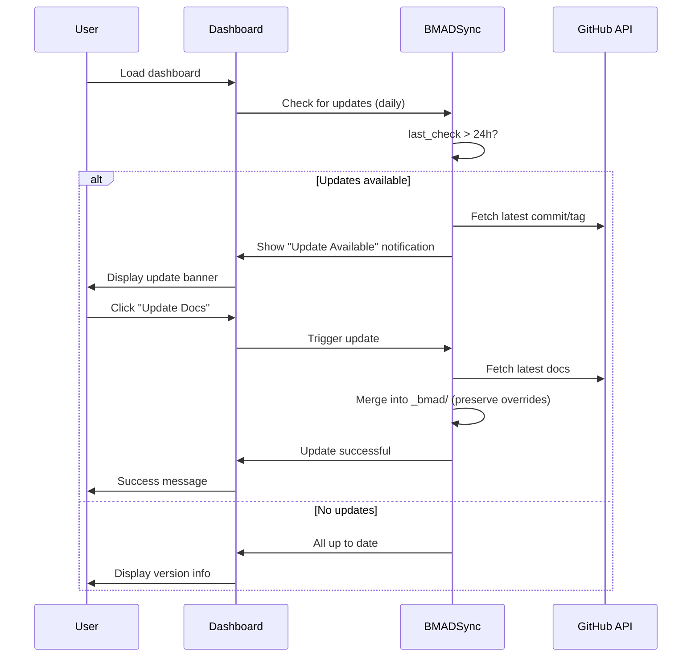

# Story 5.6: Automated BMAD Documentation Sync

## Overview

This story implements an automated system to keep the local BMAD documentation in sync with the official GitHub repository. The AI Coach relies on BMAD documentation to provide accurate guidance, and this feature ensures users always have access to the latest best practices and methods.

**Priority:** Medium
**Estimated Complexity:** Medium-High
**Dependencies:** Story 5.5 (Critical Fix - AI Context Injection & Dashboard Caching)

---

## Problem Analysis

### Current State

1. **Stale Documentation Risk**
   - BMAD is an evolving methodology with regular updates
   - Local documentation in `_bmad/` folder becomes outdated over time
   - AI Coach may reference outdated practices

2. **Manual Update Burden**
   - Users must manually check for updates
   - No indication when documentation is outdated
   - No easy way to update documentation

3. **No Version Awareness**
   - System doesn't track which BMAD version is installed
   - No comparison with latest available version
   - AI Coach cannot warn about outdated docs

### Desired State



---

## Implementation Plan

### Phase 1: Backend - BMAD Sync Service

#### 1.1 Create BMAD Sync Service

**File:** `backend/services/bmad_sync.py` (NEW)

```python
"""
Service for synchronizing local BMAD documentation with GitHub repository.
"""
import os
import json
import logging
import requests
from datetime import datetime, timedelta
from typing import Optional, Dict, Any
from pathlib import Path

logger = logging.getLogger(__name__)

class BMADSyncService:
    """Handles synchronization of BMAD documentation from GitHub."""

    def __init__(self, project_root: str, config: Dict[str, Any] = None):
        """
        Initialize BMAD sync service.

        Args:
            project_root: Root directory of the project
            config: Configuration dict with:
                - github_repo: Repository name (default: "google-deepmind/bmad")
                - bmad_docs_path: Local path for docs (default: "_bmad")
                - check_interval_hours: Hours between checks (default: 24)
        """
        self.project_root = Path(project_root)
        self.config = config or {}
        self.github_repo = self.config.get('github_repo', 'google-deepmind/bmad')
        self.bmad_docs_path = self.project_root / self.config.get('bmad_docs_path', '_bmad')
        self.check_interval = timedelta(hours=self.config.get('check_interval_hours', 24))
        self.state_file = self.project_root / '.bmad_sync_state.json'
        self._load_state()

    def _load_state(self) -> None:
        """Load sync state from file."""
        if self.state_file.exists():
            try:
                with open(self.state_file, 'r') as f:
                    self.state = json.load(f)
            except Exception as e:
                logger.error(f"Failed to load BMAD sync state: {e}")
                self.state = {}
        else:
            self.state = {}

    def _save_state(self) -> None:
        """Save sync state to file."""
        try:
            with open(self.state_file, 'w') as f:
                json.dump(self.state, f, indent=2)
        except Exception as e:
            logger.error(f"Failed to save BMAD sync state: {e}")

    def should_check_for_updates(self) -> bool:
        """
        Check if it's time to look for updates.

        Returns:
            True if more than check_interval has passed since last check
        """
        last_check = self.state.get('last_check')
        if not last_check:
            return True

        last_check_time = datetime.fromisoformat(last_check)
        return datetime.now() - last_check_time > self.check_interval

    def get_latest_github_info(self) -> Optional[Dict[str, Any]]:
        """
        Fetch latest information from GitHub repository.

        Returns:
            Dict with 'sha', 'commit_date', 'tag' or None on error
        """
        try:
            # Get latest commit on main branch
            url = f"https://api.github.com/repos/{self.github_repo}/commits/main"
            response = requests.get(url, timeout=10)
            response.raise_for_status()

            commit_data = response.json()

            # Try to get latest release tag
            tag = None
            try:
                releases_url = f"https://api.github.com/repos/{self.github_repo}/releases/latest"
                releases_response = requests.get(releases_url, timeout=10)
                if releases_response.status_code == 200:
                    release_data = releases_response.json()
                    tag = release_data.get('tag_name')
            except Exception:
                pass  # No releases or error fetching

            return {
                'sha': commit_data['sha'],
                'commit_date': commit_data['commit']['committer']['date'],
                'message': commit_data['commit']['message'],
                'tag': tag
            }

        except Exception as e:
            logger.error(f"Failed to fetch GitHub info: {e}")
            return None

    def check_for_updates(self) -> Dict[str, Any]:
        """
        Check for BMAD documentation updates.

        Returns:
            Dict with:
                - 'has_updates': bool
                - 'current_version': str
                - 'latest_version': str
                - 'latest_commit': str
                - 'last_check': str
        """
        # Update last check timestamp
        self.state['last_check'] = datetime.now().isoformat()
        self._save_state()

        # Get latest GitHub info
        github_info = self.get_latest_github_info()
        if not github_info:
            return {
                'has_updates': False,
                'error': 'Failed to fetch GitHub info',
                'last_check': self.state['last_check']
            }

        # Compare with stored version
        current_sha = self.state.get('current_sha')
        latest_sha = github_info['sha']

        # Get version info
        current_version = self.state.get('current_tag', 'unknown')
        latest_version = github_info.get('tag', 'latest')

        has_updates = current_sha != latest_sha

        return {
            'has_updates': has_updates,
            'current_version': current_version,
            'latest_version': latest_version,
            'latest_commit': latest_sha,
            'commit_message': github_info['message'],
            'commit_date': github_info['commit_date'],
            'last_check': self.state['last_check']
        }

    def update_docs(self) -> Dict[str, Any]:
        """
        Update local BMAD documentation from GitHub.

        Returns:
            Dict with 'success', 'message', 'new_version'
        """
        try:
            # This is a simplified implementation
            # In production, you'd want to use GitPython or similar

            # For now, we'll mark as updated with the latest SHA
            github_info = self.get_latest_github_info()
            if not github_info:
                return {
                    'success': False,
                    'message': 'Failed to fetch GitHub info'
                }

            # Update state
            self.state['current_sha'] = github_info['sha']
            self.state['current_tag'] = github_info.get('tag', 'latest')
            self.state['last_updated'] = datetime.now().isoformat()
            self._save_state()

            # TODO: Actual file sync logic
            # This would involve:
            # 1. Cloning or fetching the repo
            # 2. Copying docs to _bmad/ folder
            # 3. Preserving project-specific overrides

            return {
                'success': True,
                'message': 'Documentation updated successfully',
                'new_version': github_info.get('tag', 'latest'),
                'new_sha': github_info['sha']
            }

        except Exception as e:
            logger.error(f"Failed to update docs: {e}")
            return {
                'success': False,
                'message': f'Update failed: {str(e)}'
            }

    def get_status(self) -> Dict[str, Any]:
        """
        Get current BMAD sync status.

        Returns:
            Dict with version info and last check/update times
        """
        return {
            'current_version': self.state.get('current_tag', 'unknown'),
            'current_sha': self.state.get('current_sha', 'unknown'),
            'last_check': self.state.get('last_check'),
            'last_updated': self.state.get('last_updated'),
            'github_repo': self.github_repo
        }
```

#### 1.2 Add BMAD Sync API Endpoint

**File:** `backend/api/bmad_sync.py` (NEW)

```python
"""
API endpoints for BMAD documentation synchronization.
"""
from flask import Blueprint, request, jsonify
import logging
from pathlib import Path

from backend.services.bmad_sync import BMADSyncService
from backend.utils.error_handler import handle_error

logger = logging.getLogger(__name__)

bmad_sync_bp = Blueprint('bmad_sync', __name__)

@bmad_sync_bp.route('/api/bmad-sync/status', methods=['GET'])
def get_bmad_sync_status():
    """
    Get current BMAD documentation sync status.

    Query params:
        - project_root: Project root directory (required)
    """
    try:
        project_root = request.args.get('project_root')
        if not project_root:
            return jsonify({'error': 'project_root parameter required'}), 400

        sync_service = BMADSyncService(project_root)
        status = sync_service.get_status()

        # Check for updates if it's time
        if sync_service.should_check_for_updates():
            update_info = sync_service.check_for_updates()
            status['update_available'] = update_info['has_updates']
            status['latest_version'] = update_info['latest_version']
            status['latest_commit'] = update_info['latest_commit']
            status['last_check'] = update_info['last_check']
        else:
            status['update_available'] = False

        return jsonify(status)

    except Exception as e:
        logger.error(f"Error getting BMAD sync status: {e}")
        return jsonify({'error': str(e)}), 500

@bmad_sync_bp.route('/api/bmad-sync/check', methods=['POST'])
def check_bmad_updates():
    """
    Force check for BMAD documentation updates.

    Request body:
        - project_root: Project root directory (required)
    """
    try:
        data = request.get_json()
        project_root = data.get('project_root')
        if not project_root:
            return jsonify({'error': 'project_root required'}), 400

        sync_service = BMADSyncService(project_root)
        update_info = sync_service.check_for_updates()

        return jsonify(update_info)

    except Exception as e:
        logger.error(f"Error checking BMAD updates: {e}")
        return jsonify({'error': str(e)}), 500

@bmad_sync_bp.route('/api/bmad-sync/update', methods=['POST'])
def update_bmad_docs():
    """
    Update local BMAD documentation from GitHub.

    Request body:
        - project_root: Project root directory (required)
    """
    try:
        data = request.get_json()
        project_root = data.get('project_root')
        if not project_root:
            return jsonify({'error': 'project_root required'}), 400

        sync_service = BMADSyncService(project_root)
        result = sync_service.update_docs()

        if result['success']:
            return jsonify(result), 200
        else:
            return jsonify(result), 500

    except Exception as e:
        logger.error(f"Error updating BMAD docs: {e}")
        return jsonify({'error': str(e)}), 500
```

#### 1.3 Register Blueprint in App

**File:** `backend/app.py`

```python
# Add import
from backend.api.bmad_sync import bmad_sync_bp

# Register blueprint (after other blueprint registrations)
app.register_blueprint(bmad_sync_bp)
```

---

### Phase 2: Frontend - BMAD Sync UI

#### 2.1 Create BMAD Sync Component

**File:** `frontend/js/components/bmad-sync.js` (NEW)

```javascript
/**
 * BMAD Documentation Sync Component
 * Handles checking for and updating BMAD documentation
 */

export class BMADSync {
    constructor() {
        this.status = null;
        this.updateAvailable = false;
        this.isUpdating = false;
        this.projectRoot = null;
    }

    async init(projectRoot) {
        this.projectRoot = projectRoot;
        await this.checkStatus();
    }

    async checkStatus() {
        try {
            const response = await fetch(`/api/bmad-sync/status?project_root=${encodeURIComponent(this.projectRoot)}`);
            if (!response.ok) throw new Error('Failed to check status');
            this.status = await response.json();
            this.updateAvailable = this.status.update_available || false;
            this.render();
        } catch (error) {
            console.error('Error checking BMAD sync status:', error);
        }
    }

    async forceCheck() {
        try {
            const response = await fetch('/api/bmad-sync/check', {
                method: 'POST',
                headers: { 'Content-Type': 'application/json' },
                body: JSON.stringify({ project_root: this.projectRoot })
            });
            if (!response.ok) throw new Error('Failed to check updates');
            const result = await response.json();
            this.updateAvailable = result.has_updates;
            this.status = { ...this.status, ...result };
            this.render();
        } catch (error) {
            console.error('Error checking BMAD updates:', error);
        }
    }

    async updateDocs() {
        if (this.isUpdating) return;
        this.isUpdating = true;
        this.render();

        try {
            const response = await fetch('/api/bmad-sync/update', {
                method: 'POST',
                headers: { 'Content-Type': 'application/json' },
                body: JSON.stringify({ project_root: this.projectRoot })
            });
            if (!response.ok) throw new Error('Failed to update docs');
            const result = await response.json();
            this.status = { ...this.status, ...result };
            this.updateAvailable = false;
        } catch (error) {
            console.error('Error updating BMAD docs:', error);
            alert('Failed to update documentation: ' + error.message);
        } finally {
            this.isUpdating = false;
            this.render();
        }
    }

    render() {
        const container = document.getElementById('bmad-sync-container');
        if (!container) return;

        if (this.updateAvailable) {
            container.innerHTML = `
                <div class="bg-yellow-50 border border-yellow-200 rounded-lg p-4 mb-4">
                    <div class="flex items-center justify-between">
                        <div>
                            <h3 class="text-yellow-800 font-semibold">BMAD Documentation Update Available</h3>
                            <p class="text-yellow-700 text-sm mt-1">
                                Latest: ${this.status.latest_version || this.status.latest_commit?.substring(0, 7)}
                                ${this.status.commit_message ? ` - "${this.status.commit_message}"` : ''}
                            </p>
                        </div>
                        <button id="update-bmad-btn" class="bg-yellow-600 hover:bg-yellow-700 text-white px-4 py-2 rounded text-sm">
                            ${this.isUpdating ? 'Updating...' : 'Update Now'}
                        </button>
                    </div>
                </div>
            `;
            document.getElementById('update-bmad-btn')?.addEventListener('click', () => this.updateDocs());
        } else {
            container.innerHTML = `
                <div class="bg-green-50 border border-green-200 rounded-lg p-4 mb-4">
                    <div class="flex items-center justify-between">
                        <div>
                            <h3 class="text-green-800 font-semibold">BMAD Documentation Up to Date</h3>
                            <p class="text-green-700 text-sm mt-1">
                                Version: ${this.status.current_version}
                                ${this.status.last_updated ? `(Last updated: ${new Date(this.status.last_updated).toLocaleDateString()})` : ''}
                            </p>
                        </div>
                        <button id="check-bmad-btn" class="text-green-700 hover:text-green-800 text-sm underline">
                            Check for updates
                        </button>
                    </div>
                </div>
            `;
            document.getElementById('check-bmad-btn')?.addEventListener('click', () => this.forceCheck());
        }
    }
}

// Singleton instance
let bmadSyncInstance = null;

export function getBMADSync() {
    if (!bmadSyncInstance) {
        bmadSyncInstance = new BMADSync();
    }
    return bmadSyncInstance;
}
```

#### 2.2 Integrate BMAD Sync into Dashboard

**File:** `frontend/js/views/dashboard.js`

```javascript
// Add import
import { getBMADSync } from '../components/bmad-sync.js';

// In renderDashboard() function, add BMAD sync status check
async function renderDashboard(projectRoot) {
    // ... existing code ...

    // Initialize BMAD sync
    const bmadSync = getBMADSync();
    await bmadSync.init(projectRoot);

    // ... rest of code ...
}
```

#### 2.3 Add BMAD Sync Container to HTML

**File:** `frontend/index.html`

```html
<!-- Add in the main content area, before the dashboard -->
<div id="bmad-sync-container"></div>
```

#### 2.4 Update AI Coach with BMAD Version Info

**File:** `backend/services/ai_coach.py`

```python
# In _build_system_prompt(), add BMAD version info
def _build_system_prompt(self, context: Dict[str, Any]) -> str:
    # ... existing code ...

    # Add BMAD version info
    bmad_version_info = ""
    if self.project_root:
        try:
            from backend.services.bmad_sync import BMADSyncService
            sync_service = BMADSyncService(self.project_root)
            status = sync_service.get_status()
            bmad_version_info = f"\n\nBMAD VERSION: {status.get('current_version', 'unknown')}"
            if status.get('update_available'):
                bmad_version_info += " (UPDATE AVAILABLE - User should update docs)"
        except Exception as e:
            logger.warning(f"Could not load BMAD version info: {e}")

    # ... incorporate into system prompt ...
```

---

## Acceptance Criteria Verification

### AC1: Daily Update Check

**Test Steps:**
1. Set system time to 25 hours ago
2. Load dashboard
3. Verify: System checks GitHub for updates
4. Verify: `last_check` timestamp is updated
5. Verify: No check happens again within 24 hours

**Expected Result:**
- GitHub API called once per 24-hour period
- State file updated with `last_check`

### AC2: Update Notification

**Test Steps:**
1. Modify `current_sha` in `.bmad_sync_state.json` to an old value
2. Load dashboard
3. Verify: Yellow "Update Available" banner shown
4. Verify: Banner shows latest commit/message

**Expected Result:**
```
BMAD Documentation Update Available
Latest: v1.2.3 - "Added new workflow patterns"
[Update Now]
```

### AC3: One-Click Update

**Test Steps:**
1. With update available, click "Update Now"
2. Verify: Button shows "Updating..." state
3. Verify: Update API called
4. Verify: Success message shown
5. Verify: Banner changes to green "Up to Date"

**Expected Result:**
- Update completes successfully
- State file updated with new SHA
- Banner reflects new state

### AC4: AI Coach Version Awareness

**Test Steps:**
1. Load AI chat
2. Ask: "What BMAD version are you using?"
3. Verify: AI responds with current version
4. With outdated docs, verify AI mentions update available

**Expected Result:**
```
AI: I'm using BMAD version 1.2.3. Note: An update is available.
```

---

## Files to Modify

### Backend (NEW)
- `backend/services/bmad_sync.py` - BMAD sync service
- `backend/api/bmad_sync.py` - BMAD sync API endpoints

### Backend (MODIFIED)
- `backend/app.py` - Register BMAD sync blueprint
- `backend/services/ai_coach.py` - Add BMAD version to context

### Frontend (NEW)
- `frontend/js/components/bmad-sync.js` - BMAD sync UI component

### Frontend (MODIFIED)
- `frontend/js/views/dashboard.js` - Initialize BMAD sync
- `frontend/index.html` - Add BMAD sync container

---

## Risk Assessment

| Risk                          | Likelihood | Impact | Mitigation                                                   |
| ----------------------------- | ---------- | ------ | ------------------------------------------------------------ |
| GitHub API rate limits        | Medium     | Low    | Cache results, respect rate limits, use conditional requests |
| File sync conflicts           | Medium     | Medium | Preserve project-specific overrides, use safe merge strategy |
| Network errors during update  | High       | Low    | Show clear error messages, allow retry                       |
| Breaking changes in BMAD docs | Low        | Medium | Test with sample updates, provide rollback option            |
| Large documentation size      | Low        | Low    | Only sync changed files, use efficient transfer              |

---

## Dependencies

- Depends on: Story 5.5 (Critical Fix - AI Context Injection & Dashboard Caching) - ensures dashboard loads correctly
- Blocks: None (standalone feature)

---

## Future Enhancements

1. **Selective Update**: Allow users to choose which documentation files to update
2. **Rollback**: Ability to revert to previous BMAD version
3. **Diff Preview**: Show what changed before updating
4. **Custom Repository**: Support for forked or custom BMAD repositories
5. **Offline Mode**: Graceful handling when GitHub is unavailable
6. **Scheduled Updates**: Background sync without user intervention
7. **Change Log**: Display BMAD changelog in update notification

---

## Notes

- **Security**: Never expose GitHub tokens in client-side code
- **Performance**: Use GitHub's conditional requests (ETag) to minimize bandwidth
- **User Experience**: Make updates optional - don't force updates automatically
- **Testing**: Mock GitHub API responses for reliable testing
- **Documentation**: Document the override mechanism for project-specific customizations
